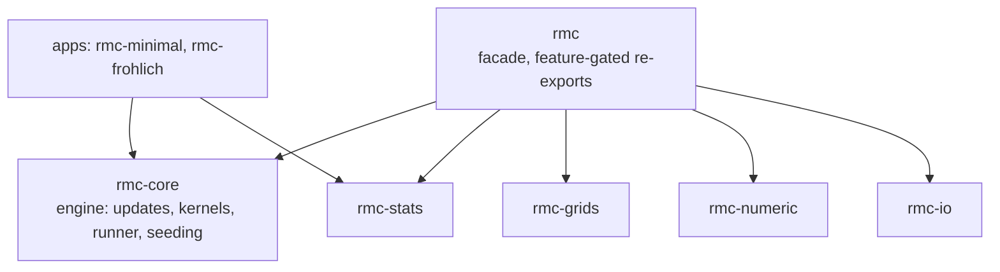
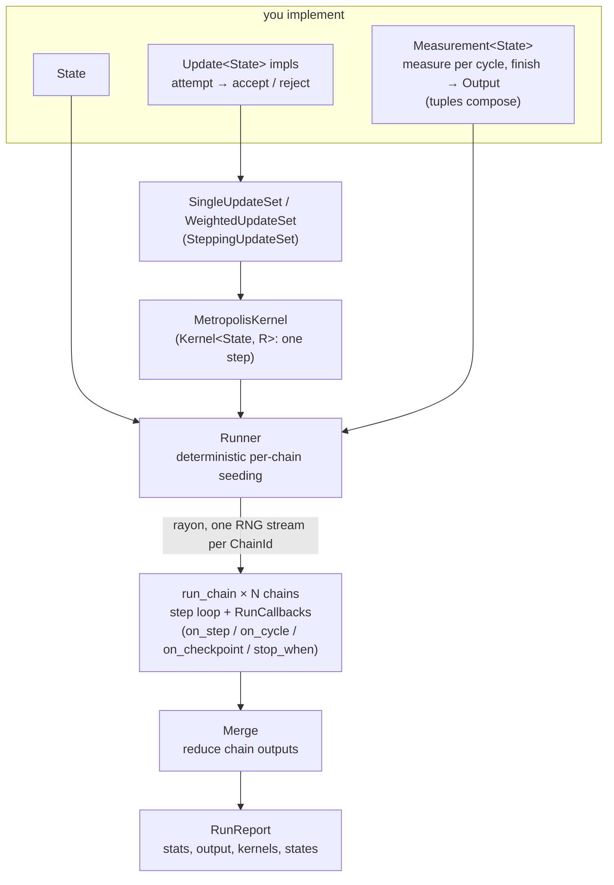

```
 ___                 __  __  ____
|_ _|_ __ ___  _ __ |  \/  |/ ___|
 | || '__/ _ \| '_ \| |\/| | |
 | || | | (_) | | | | |  | | |___
|___|_|  \___/|_| |_|_|  |_|\____|
```

> *because iron rusts*

IronMC is the Rust port of the `simplemc` Monte-Carlo framework.

## Overview

IronMC is a small engine layer for reproducible Monte Carlo simulations: state-generic
updates and measurements, Metropolis kernels, deterministic per-chain seeding,
rayon-backed independent-chain execution, and a `Merge` trait for reducing independent
outputs. Statistical accumulators, grids, numerics, and IO live in sibling crates so the
engine layer stays dependency-light.

The framework crates live directly under `crates/` (`rmc-core` plus supporting numeric,
grid, IO, and statistics crates, and the `rmc` facade). Application crates built on the
framework live under `crates/apps/` — `rmc-frohlich` (the full polaron engine) and
`rmc-minimal` (a minimal benchmark harness) — kept in this repo so they double as perf
regression fixtures.

## Architecture

Crate layering — apps depend on the engine and batteries directly; the `rmc` facade
re-exports them behind feature gates:



One MC run — you implement the pieces on the left, the engine drives the loop:



## Getting started

```sh
cargo test --workspace   # run the workspace test suite
make run                 # default Fröhlich-polaron run
```

The `crates/rmc/examples/` directory is the best place to learn the API, smallest first:
[`random_walk.rs`](crates/rmc/examples/random_walk.rs),
[`ising_2d.rs`](crates/rmc/examples/ising_2d.rs), and
[`named_results.rs`](crates/rmc/examples/named_results.rs). The
[`rmc-minimal`](crates/apps/rmc-minimal) and [`rmc-frohlich`](crates/apps/rmc-frohlich)
app crates show full simulations end to end.

## Choosing update ratios

A `WeightedUpdateSet` picks an update each step in proportion to its weight. Each entry
also carries a proposal-ratio multiplier folded into the Metropolis acceptance
probability, so detailed balance holds even when forward and reverse moves are proposed
with different selection probabilities. Three ways to build entries:

```rust
use rmc::mc::{WeightedUpdate, WeightedUpdateSet};

// Symmetric / default: forward and reverse proposed with equal probability -> ratio 1.0.
let entry = WeightedUpdate::new(update, 2.0);

// Simple inverse pair (e.g. insert/remove): reciprocal proposal-selection ratios
// w_b/w_a and w_a/w_b are inferred from the two weights automatically.
let set = WeightedUpdateSet::inverse_pair(insert, 2.0, remove, 4.0)?;

// Anything more specific: supply the explicit proposal-ratio multiplier yourself.
let entry = WeightedUpdate::with_ratio(update, 2.0, 0.5);
```

## Performance testing

Install the comparison tool with:

```nu
cargo install --git https://github.com/samox73/cargo-bench-compare
```

Both benchmark binaries do a one-shot run and print a `steps/sec: <value>` line.
Repetitions, revision checkout, the tuned profile (`release-tuned`), and
`-C target-cpu=native` are handled by `cargo bench-compare`; use `--runs-on-core <n>` for
CPU pinning instead of the manual `taskset` used by the Makefile targets.

The examples below are written as single logical commands so they work in Bash, Nushell,
and other common shells. Replace `BASE_SHA` with the base revision you want to compare
against.

```nu
# framework hot path (rmc-minimal), current state vs the merge-base
cargo bench-compare -p rmc-minimal --bin rmc-minimal --reps 5 --metric-regex 'steps/sec:\s*([\d.]+)' -- full 100000000

# framework hot path (rmc-minimal), current (unstaged) state vs the last commit
cargo bench-compare -p rmc-minimal --bin rmc-minimal --reps 5 --metric-regex 'steps/sec:\s*([\d.]+)' --rev-base HEAD -- full 100000000

# full polaron engine (rmc-frohlich)
cargo bench-compare -p rmc-frohlich --bin rmc-frohlich --reps 5 --metric-regex 'steps/sec:\s*([\d.]+)' -- bench fixtures/bench-frohlich.json
```

## Writing examples

An app implements a `State`, one or more `Update<State>` impls (use `dispatch_update!` to
build a single enum over a heterogeneous set of updates), and any `Measurement<State>`s,
then hands them to the `Runner`. See `crates/rmc/examples/` and the two app crates above
as templates.
