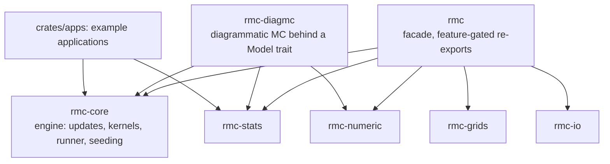
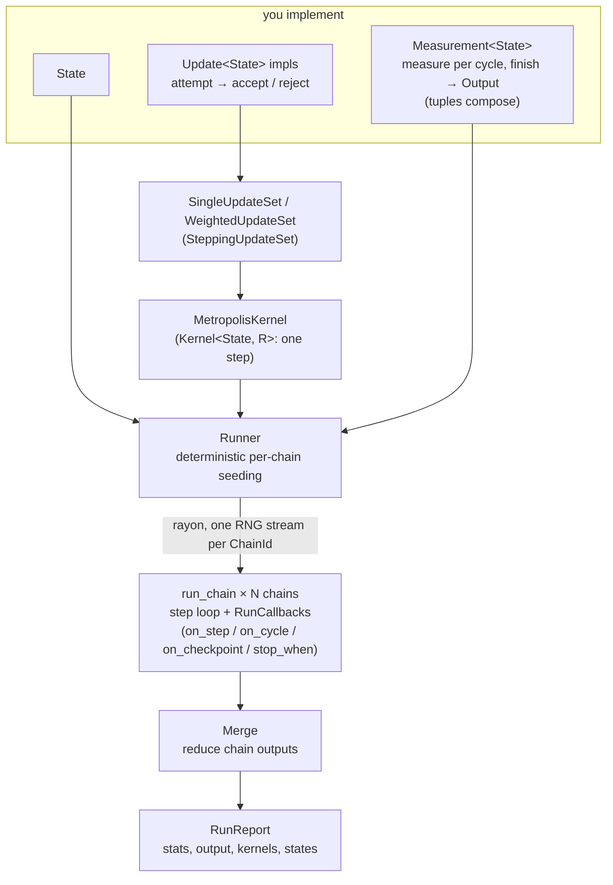

```
 ___                 __  __  ____
|_ _|_ __ ___  _ __ |  \/  |/ ___|
 | || '__/ _ \| '_ \| |\/| | |
 | || | | (_) | | | | |  | | |___
|___|_|  \___/|_| |_|_|  |_|\____|
```

> _because iron rusts_

IronMC started as the Rust port of the `simplemc` Monte-Carlo framework.

IronMC is a small, fast engine for reproducible Markov-chain Monte Carlo in Rust. You describe a simulation as a chain **state**, a set of **updates** that propose moves on it, and **measurements** taken once per cycle. The engine runs the Metropolis loop, drives many independent chains in parallel, and merges their results, with a guarantee that the same seed always gives the same numbers, whatever the thread scheduling.

## Features

- **State-generic, statically dispatched.** `Update<State>`, `Measurement<State>`, and `Kernel<State, R>` are plain traits, monomorphized over the RNG so every draw inlines. `dispatch_update!` turns a heterogeneous set of updates into one enum without trait objects.
- **Metropolis with correct proposal ratios.** `WeightedUpdateSet` selects updates by weight and folds proposal-selection ratios into the acceptance (see [Choosing update ratios](#choosing-update-ratios)). Updates can report a move as *impossible*, which is counted separately from rejection.
- **Reproducible parallel chains.** `SeedSource` derives one xoshiro256++ stream per `ChainId` from a master seed. Chain ids are data, not thread ids, so rayon scheduling never changes which stream a chain gets.
- **Typed results and merging.** Measurements return typed outputs by ownership (tuples compose). The `Merge` trait reduces per-chain outputs into one result.
- **Long runs.** A separate warmup phase, per-step/cycle/checkpoint callbacks with early stop, a wall-clock deadline (`WithDeadline`), bit-identical checkpoint/resume (`Runner::run_resumable`), and chain-id offsets for multi-process runs that merge exactly as one big run.
- **Statistics.** Mergeable accumulators (moments, weighted moments, covariance, autocorrelation, batch and block means, jackknife) and `BinnedScalar`, a drop-in measurement with block-jackknife error bars.
- **Batteries.** Grids, interpolation and quadrature, versioned JSON checkpoint envelopes, `indicatif` progress bars, and `rmc-diagmc`, an imaginary-time diagrammatic MC engine behind a `Model` trait.

## Crates

The framework crates live directly under `crates/`:

| Crate | Role |
| --- | --- |
| `rmc-core` | engine: `Update`/`Measurement`/`Kernel` traits, update sets, Metropolis kernel, `Runner`, seeding, `Merge` |
| `rmc-stats` | mergeable statistical accumulators (sufficient statistics that reduce across chains) |
| `rmc-grids` | one- and multi-dimensional grids for sampling, binning, and interpolation |
| `rmc-numeric` | interpolation and quadrature on `rmc-grids` grids |
| `rmc-io` | versioned checkpoint/restart envelopes around serde payloads |
| `rmc-diagmc` | imaginary-time diagrammatic MC engine: diagram state, updates, and estimators behind a `Model` trait |
| `rmc` | facade with feature-gated re-exports of `rmc-core` and the batteries |

Example applications built on the framework live under [`crates/apps/`](crates/apps/README.md). They double as the perf-regression fixtures.

## Architecture

Crate layering: apps depend on the engine and batteries directly, and the `rmc` facade re-exports them behind feature gates (`rmc-diagmc` is used directly, not through the facade):


```mermaid
graph TD
    facade["rmc<br/>facade, feature-gated re-exports"]
    core["rmc-core<br/>engine: updates, kernels, runner, seeding"]
    stats["rmc-stats"]
    grids["rmc-grids"]
    numeric["rmc-numeric"]
    io["rmc-io"]
    diagmc["rmc-diagmc<br/>diagrammatic MC behind a Model trait"]
    apps["crates/apps: example applications"]

    facade --> core
    facade --> stats
    facade --> grids
    facade --> numeric
    facade --> io
    diagmc --> core
    diagmc --> stats
    diagmc --> numeric
    apps --> core
    apps --> stats
```

One MC run — you implement the pieces at the top, the engine drives the loop:


```mermaid
graph TD
    subgraph you["you implement"]
        state["State"]
        updates["Update&lt;State&gt; impls<br/>attempt → accept / reject"]
        meas["Measurement&lt;State&gt;<br/>measure per cycle, finish → Output<br/>(tuples compose)"]
    end

    updates --> set["SingleUpdateSet / WeightedUpdateSet<br/>(SteppingUpdateSet)"]
    set --> kernel["MetropolisKernel<br/>(Kernel&lt;State, R&gt;: one step)"]

    state --> runner["Runner<br/>deterministic per-chain seeding"]
    kernel --> runner
    meas --> runner

    runner -->|"rayon, one RNG stream per ChainId"| chains["run_chain × N chains<br/>step loop + RunCallbacks<br/>(on_step / on_cycle / on_checkpoint / stop_when)"]
    chains --> merge["Merge<br/>reduce chain outputs"]
    merge --> report["RunReport<br/>stats, output, kernels, states"]
```

## Installation

IronMC is not on crates.io yet; depend on it through git (MSRV: Rust 1.75):

```toml
[dependencies]
rmc = { git = "https://github.com/samox73/ironmc", features = ["stats", "io"] }
```

Facade features:

| Feature | Enables |
| --- | --- |
| `stats` (default) | `rmc::stats` (`rmc-stats`) |
| `grids` (default) | `rmc::grids` (`rmc-grids`) |
| `numeric` | `rmc::numeric` (`rmc-numeric`; implies `grids`) |
| `io` | `rmc::io` (`rmc-io`; implies `serde`) |
| `serde` | `Serialize`/`Deserialize` on core and battery types, including `SeedSource`, `ChainId`, and the RNG, so chain states and RNGs can be checkpointed |

`rmc-diagmc` is not re-exported by the facade; depend on it directly (`rmc-diagmc = { git = "https://github.com/samox73/ironmc" }`).

## Quick start

Metropolis sampling of a unit Gaussian, π(x) ∝ exp(−x²/2), on 8 chains. This is [`crates/rmc/examples/quickstart.rs`](crates/rmc/examples/quickstart.rs); run it with `cargo run --release -p rmc --example quickstart`.

```rust
use rmc::mc::{MetropolisKernel, Runner, SimulationParams, SingleUpdateSet, Update, UpdateSet};
use rmc::random::{ChainId, Rng, SeedSource};
use rmc::stats::BinnedScalar;

/// Uniform shift x → x + width·(2u − 1): symmetric, so the Metropolis acceptance is π(x')/π(x).
struct Shift {
    width: f64,
    proposed: f64,
}

impl Update<f64> for Shift {
    fn attempt<R: Rng + ?Sized>(&mut self, x: &mut f64, rng: &mut R) -> f64 {
        self.proposed = *x + self.width * (2.0 * rng.gen::<f64>() - 1.0);
        (-(self.proposed * self.proposed - *x * *x) / 2.0).exp()
    }

    fn accept(&mut self, x: &mut f64) {
        *x = self.proposed;
    }
}

/// Everything one chain needs: initial state, kernel, and measurement. Called once per chain.
fn build_chain(
    _chain: ChainId,
) -> (f64, MetropolisKernel<SingleUpdateSet<Shift>>, BinnedScalar<impl Fn(&f64) -> f64>) {
    let kernel = MetropolisKernel::new(SingleUpdateSet::new(Shift { width: 2.5, proposed: 0.0 }));
    let x_squared = BinnedScalar::new(1_000, |x: &f64| x * x).expect("block size > 0");
    (0.0, kernel, x_squared)
}

fn main() -> rmc::Result<()> {
    let params = SimulationParams { max_steps: 1_000_000, steps_per_cycle: 10, cycles_per_check: 0 };
    let warmup = SimulationParams { max_steps: 10_000, ..params };

    let report = Runner::new(SeedSource::new(42), build_chain)
        .chains(8)
        .warmup(warmup)
        .run(params)?;

    let x2 = report.output; // the 8 chains' jackknife blocks, merged
    let stats = report.kernels[0].updates().stats()[0];
    println!(
        "<x^2> = {:.4} +/- {:.4} (exact 1), {} steps, acceptance {:.2} (chain 0)",
        x2.estimate().unwrap(),
        x2.standard_error().unwrap(),
        report.stats.steps_done,
        stats.naccs as f64 / stats.nprops as f64,
    );
    Ok(())
}
```

Output (the jackknife error bar comes from blocks of 1000 cycles, merged across chains):

```
<x^2> = 1.0020 +/- 0.0016 (exact 1), 8000000 steps, acceptance 0.56 (chain 0)
```

Next steps, smallest first: [`random_walk.rs`](crates/rmc/examples/random_walk.rs) (single chain vs `Runner`, a hand-written `Merge`), [`named_results.rs`](crates/rmc/examples/named_results.rs) (tuple measurements, JSON output), [`ising_2d.rs`](crates/rmc/examples/ising_2d.rs) (a lattice model with two `BinnedScalar` observables). For complete applications, see [`crates/apps/`](crates/apps/README.md).

## Core concepts

- **State** is any type you choose. Each chain owns its own, so there is no shared mutable state between chains.
- **`Update<State>`**: `attempt(&mut state, &mut rng) -> f64` proposes a move and returns its acceptance probability (`>= 1` always accepts, `< 0` marks the move impossible); `accept` commits it; `reject` rolls it back (default no-op, for updates that don't touch the state until `accept`).
- **Update sets**: `SingleUpdateSet` for one update, `WeightedUpdateSet` for several. Combine different update types with `dispatch_update!` (add `; reject` to forward `reject`):

  ```rust
  rmc::dispatch_update! {
      #[derive(Clone, Debug)]
      pub enum MyUpdate<MyState> {
          Shift(Shift),
          Flip(Flip),
      }
  }
  ```

- **Kernel**: `MetropolisKernel::new(update_set)` performs one step (select, attempt, accept or reject) and keeps per-update statistics (`UpdateStats`: proposed, accepted, impossible).
- **`Measurement<State>`**: `measure(&state)` once per cycle and `finish() -> Output`. Tuples of measurements are measurements.
- **`Merge`**: how outputs of independent chains combine. Merge sufficient statistics (sums, counts, blocks), never per-chain means.
- **`SimulationParams`**: `max_steps` per chain, `steps_per_cycle` (steps between measurements), and `cycles_per_check` (cycles between checkpoint callbacks and `stop_when` checks; `0` disables them).
- **`Runner`**: `Runner::new(seed, build_chain)` where `build_chain(ChainId) -> (State, Kernel, Measurement)`; configure with `.chains(n)`, `.warmup(params)`, `.callbacks(...)`, `.pool(&thread_pool)`, `.chain_offset(k)`, then `.run(params)`. The `RunReport` holds merged `stats` and `output`, plus every chain's final `kernels`, `states`, and `rngs`. `run_chain` drives a single chain without the runner.

## Long runs: checkpoints, deadlines, multiple processes

```rust
// Leg 1, then resume every chain from its final (state, rng): bit-identical to one long run.
let first = Runner::new(seed, build_chain).chains(8).run(leg)?;
let resume: Vec<_> = first.states.into_iter().zip(first.rngs).collect();
let second = Runner::new(seed, build_chain).chains(8).run_resumable(leg, Some(resume))?;

// Stop cleanly at a wall-clock deadline (checked every cycles_per_check cycles).
let deadline = Some(Instant::now() + Duration::from_secs(600));
let timed = Runner::new(seed, build_chain)
    .chains(8)
    .callbacks(move |_chain| WithDeadline { inner: NoopCallbacks, deadline })
    .run(SimulationParams { cycles_per_check: 100, ..leg })?;

// Process r of a multi-process run: distinct streams; the merged outputs equal one big run.
let rank_r = Runner::new(seed, build_chain).chains(8).chain_offset(r * 8).run(leg)?;
```

With the `serde` feature, states, RNGs, and outputs can be written to disk between legs; `rmc::io` (feature `io`) wraps payloads in versioned JSON checkpoint envelopes (`save_payload_json`/`load_payload_json`).

## Choosing update ratios

A `WeightedUpdateSet` picks an update each step in proportion to its weight. Each entry also carries a proposal-ratio multiplier folded into the Metropolis acceptance probability, so detailed balance holds even when forward and reverse moves are proposed with different selection probabilities. Three ways to build entries:

```rust
use rmc::mc::{WeightedUpdate, WeightedUpdateSet};

// Symmetric / default: forward and reverse proposed with equal probability -> ratio 1.0.
let entry = WeightedUpdate::new(update, 2.0);

// Simple inverse pair (e.g. insert/remove): reciprocal proposal-selection ratios
// w_b/w_a and w_a/w_b are inferred from the two weights automatically.
let set = WeightedUpdateSet::inverse_pair(insert, 2.0, remove, 4.0)?;

// Anything more specific: supply the explicit proposal-ratio multiplier yourself.
let entry = WeightedUpdate::with_ratio(update, 2.0, 0.5);
```

## Performance testing

Install the comparison tool with:

```nu
cargo install --git https://github.com/samox73/cargo-bench-compare
```

The two benchmark fixtures, [`rmc-minimal`](crates/apps/rmc-minimal) (framework hot path) and [`rmc-frohlich`](crates/apps/rmc-frohlich) (a full application), each do a one-shot run and print a `steps/sec: <value>` line. Repetitions, revision checkout, the tuned profile (`release-tuned`), and `-C target-cpu=native` are handled by `cargo bench-compare`; use `--runs-on-core <n>` for CPU pinning instead of the manual `taskset` used by the Makefile targets.

The examples below are written as single logical commands so they work in Bash, Nushell, and other common shells. `make bench` runs the same comparisons for all fixtures.

```nu
# framework hot path (rmc-minimal), current state vs the merge-base
cargo bench-compare -p rmc-minimal --bin rmc-minimal --reps 5 --metric-regex 'steps/sec:\s*([\d.]+)' -- full 100000000

# framework hot path (rmc-minimal), current (unstaged) state vs the last commit
cargo bench-compare -p rmc-minimal --bin rmc-minimal --reps 5 --metric-regex 'steps/sec:\s*([\d.]+)' --rev-base HEAD -- full 100000000

# full application (rmc-frohlich)
cargo bench-compare -p rmc-frohlich --bin rmc-frohlich --reps 5 --metric-regex 'steps/sec:\s*([\d.]+)' -- bench fixtures/bench-frohlich.json
```

## Development

- Tests: `cargo test --release --workspace`.
- Formatting: `cargo fmt` with the repository's `rustfmt.toml`.
- Contributor and agent conventions: [`AGENTS.md`](AGENTS.md).

## License

MIT, see [`LICENSE`](LICENSE).
