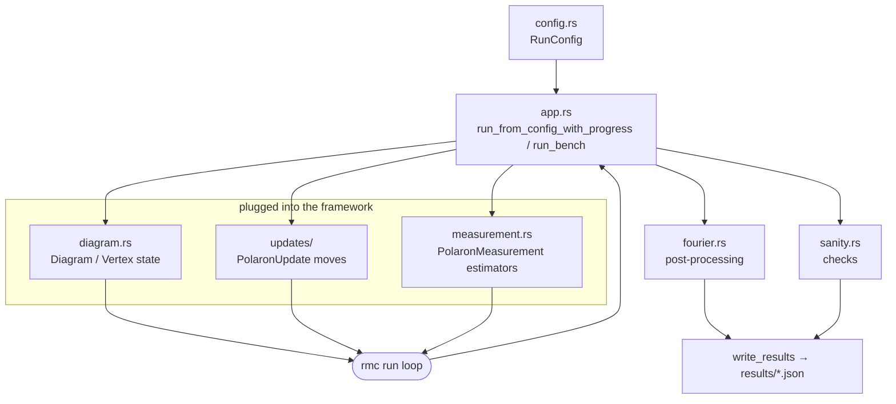

# rmc-frohlich



Diagrammatic Monte Carlo for the Fröhlich polaron self-energy. The "real application" fixture
for this workspace, as opposed to the toy `rmc-minimal` benchmark.

## Run

```bash
make run                                     # release build against ./input.json
cargo run -p rmc-frohlich -- def             # print the default RunConfig as JSON
cargo run -p rmc-frohlich -- bench           # timed sampling loop only, no output files
cargo run -p rmc-frohlich -- <config.json> [results_dir]   # full run with progress bar
```

Results (config, summary, raw stats, self-energy, FFT, checkpoint) are written as JSON to
`results/` by default.
