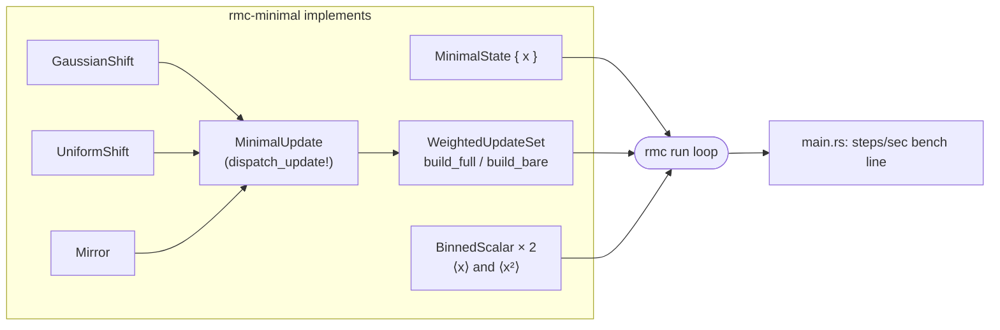

# rmc-minimal



Samples a 1-D unit Gaussian with three toy updates (Gaussian shift, uniform shift, mirror).
Exists as the framework hot-path benchmark fixture, not a physics application.

## Run

```bash
cargo run -p rmc-minimal -- full 100000000   # all three updates, measures <x> and <x^2>
cargo run -p rmc-minimal -- bare 100000000   # single-update hot path, no measurement
```

Args are `[full|bare] [max_steps] [warmup_steps]` (default `full`); see `src/main.rs`.

## Output

Prints a `steps/sec: <value>` line consumed by `cargo bench-compare` (see `make bench-minimal`).
